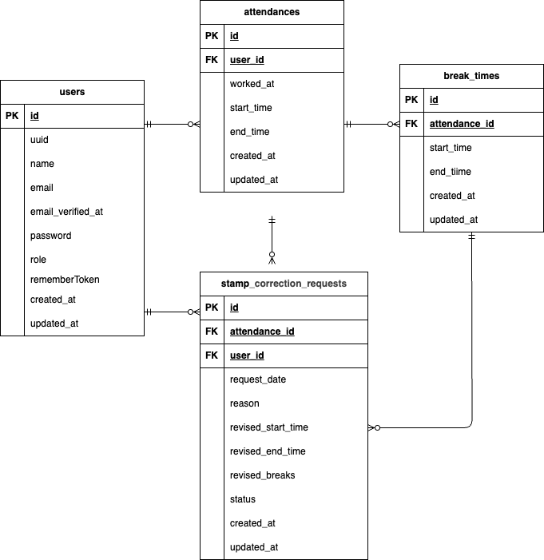

# 勤怠管理アプリ

## 環境構築

1. ```
   git clone git@github.com:yoko-bessho/attendance-management.git
   ```
2. DockerDesktopを立ち上げる。
3. プロジェクト直下で以下のコマンドを実行する。
   ```
   make init
   ```

   Mac の M1・M2 チップの PC の場合、no matching manifest for linux/arm64/v8 in the manifest list entries のメッセージが表示されビルドができないことがあります。 エラーが発生する場合は、docker-compose.yml ファイルの「mysql」内に「platform」の項目を追加で記載してください。
   ```
   mysql:
      image: mysql:8.0.26
      platform: linux/x86_64   //(この文追加)
   ```

4. 作成された .envへ以下の環境変数と管理者ユーザー情報を追加してください
   ```
   DB_HOST=mysql
   DB_PORT=3306
   DB_DATABASE=laravel_db
   DB_USERNAME=laravel_user
   DB_PASSWORD=laravel_pass

   管理者用ユーザ
	ADMIN_EMAIL=				#メールアドレス"
   ADMIN_PASSWORD=		   #パスワード"
   ```

5. .envの編集後、以下を実行
   ```
   make after-env
   ```
## メール認証設定
mailtrapというツールを使用しています。
以下のリンクから会員登録をしてください。
https://mailtrap.io/

1. Mysandbox を開き、Integrationのphp 一覧より「laravel 7.x and 8.x」を選択する。

2. 環境変数とパスワードをコピーし、.env へ貼り付ける。
   デフォルト部分はコメントアウトか削除する。

3. ```
   docker compose exec php php artisan config:clear
   ```
   メール認証テストはmailtrapに届いたメールの認証ボタンを押して認証してください。


## テーブル仕様
**1. usersテーブル**

| カラム名               | 型               | PK | UNIQUE | NOT NULL | FK |
| ------------------ | --------------- | -- | ------ | -------- | -- |
| id                 | unsigned bigint | ○  |        | ○        |    |
| uuid               | uuid            |    | ○      | ○        |    |
| name               | string          |    |        | ○        |    |
| email              | string          |    | ○      | ○        |    |
| email_verifided_at | timestamp       |    |        |          |    |
| password           | string          |    |        | ○        |    |
| role               | string(enum)    |    |        | ○        |    |
| remember_token     | rememberToken   |    |        | ○        |    |
| created_at         | timestamp       |    |        |          |    |
| updated_at         | timestamp       |    |        |          |    |

**2. attendancesテーブル**

| カラム名       | 型               | PK | UNIQUE | NOT NULL | FK        |
| ---------- | --------------- | -- | ------ | -------- | --------- |
| id         | unsigned bigint | ○  |        | ○        |           |
| user_id    | unsigned bigint |    |        | ○        | users(id) |
| start_time | datetime        |    |        | ○        |           |
| end_time   | datetime        |    |        |          |           |
| worked_at  | datetime        |    |        | ○        |           |
| created_at | timestamp       |    |        |          |           |
| updated_at | timestamp       |    |        |          |           |

**3. bread_timesテーブル**

| カラム名           | 型               | PK | UNIQUE | NOT NULL | FK              |
| -------------- | --------------- | -- | ------ | -------- | --------------- |
| id             | unsigned bigint | ○  |        | ○        |                 |
| attendances_id | unsigned bigint |    |        | ○        | attendances(id) |
| start_time     | datetime        |    |        | ○        |                 |
| end_time       | datetime        |    |        |          |                 |
| created_at     | timestamp       |    |        |          |                 |
| updated_at     | timestamp       |    |        |          |                 |

**4. stamp_correction_requestsテーブル**

| カラム名               | 型               | PK | UNIQUE | NOT NULL | FK              |
| ------------------ | --------------- | -- | ------ | -------- | --------------- |
| id                 | unsigned bigint | ○  |        | ○        |                 |
| attendance_id      | unsigned bigint |    |        | ○        | attendances(id) |
| user_id            | unsigned bigint |    |        | ○        | users(id)       |
| request_date       | date            |    |        | ○        |                 |
| reason             | string          |    |        | ○        |                 |
| revised_start_time | datetime        |    |        |          |                 |
| revised_end_time   | datetime        |    |        |          |                 |
| revised_breaks | json        |    |        |          |                 |
| status             | string(enum)    |    |        | ○        |                 |
| created_at         | timestamp       |    |        |          |                 |
| updated_at         | timestamp       |    |        |          |                 |

## ER図


## テストアカウント
name:管理者
email: admin@example.com
password: adminpassword
name: 一般ユーザ
email: general1@example.com
password: password

## PHPUnitを使用したテストは以下を実行してください
**1. テスト用データベースの作成**
```
docker-compose exec mysql bash
mysql -u root -p
//パスワードはrootと入力
create database demo_test;
```

.env.testingのAPP_KEY=を空にする
```
docker compose exec php bash
php artisan config:clear
```

**2.テスト実行**
```
docker-compose exec php bash
php artisan migrate:fresh --env=testing
./vendor/bin/phpunit
```

### 使用技術（実行環境）

- PHP 8.4.1
- Laravel Framework 8.83.29
- mysql from 11.8.3-MariaDB, client 15.2 for debian-linux-gnu (aarch64)
- 認証：mailtrap

### URL

・ 開発環境：http://localhost/
・ phpMyadmin：http://localhost:8080/

